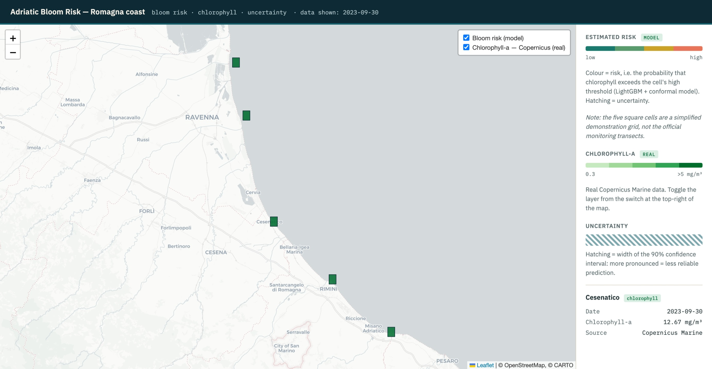
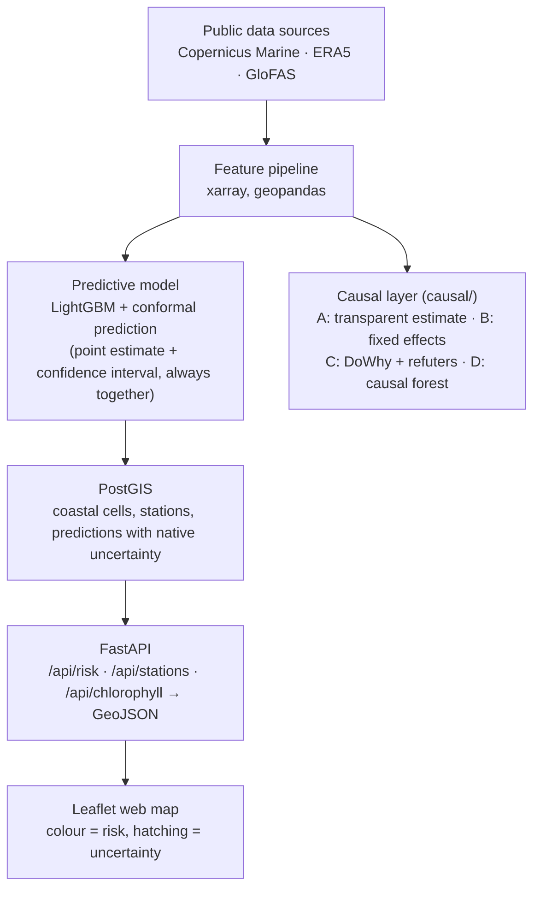

# Adriatic Bloom Risk — Romagna coast

[](https://doi.org/10.5281/zenodo.21204039)
[](https://github.com/antoniorotundo2/adriatic-bloom-risk/actions/workflows/ci.yml)
[](LICENSE)

A geospatial information system that combines free satellite data and in-situ
monitoring to map the **phytoplankton bloom risk** along the Romagna coast (northern Adriatic), with
**quantified uncertainty** on every prediction, and a causal analysis of the
effect of the Po river discharge on chlorophyll.

> **Technical report:** a working-paper writeup of this project (method, results, honest positioning and limitations) is available at [`docs/technical-report.md`](docs/technical-report.md), and as a citable preprint on Zenodo (DOI above).



*Interactive web map: model-estimated bloom risk and real Copernicus Marine chlorophyll-a per coastal cell, with the detail panel showing the prediction, its 90% interval and the cell threshold.*

## Architecture



## Requirements

### Software
- Docker and Docker Compose
- Python >= 3.11
- A free Copernicus Marine account (chlorophyll, SST)
- A free ECMWF account (ERA5 wind on the CDS, GloFAS Po discharge on the EWDS)

## Configuration

The pipeline downloads data from two services, each with its own credentials.

- **Copernicus Marine**: run `copernicusmarine login` once (interactive).
- **Climate Data Store / Early Warning Data Store**: put your ECMWF token in
  `~/.cdsapirc`:
  ```
  url: https://cds.climate.copernicus.eu/api
  key: <YOUR-TOKEN>
  ```
  The same token works for both stores; the EWDS URL is set inside the script.
  Each dataset licence must be accepted once on its download page.

## Install

```bash
make install
```

Creates a virtualenv in `.venv` and installs the pipeline dependencies.

## Run

### Stack (Docker, recommended)

```bash
make run
```

- Map: http://localhost:8000
- API: http://localhost:8000/api/risk

The system starts with **demo data** (5 cells along the coast, from the Po mouth
to Cattolica) - see `db/init.sql`. No real data is needed to see it working.

### Pipeline (real data -> model)

With the stack running:

```bash
make ingest      # download all public data, multi-year (long: CDS/EWDS queue)
make features    # build the feature table
make train       # train the model, write predictions, replace the demo data
make run         # rebuild the API to serve the new predictions
```

### Causal analysis

```bash
make causal      # Step A (transparent) + Step B (DoWhy with refuters)
```

See `causal/README.md` for the DAG, results and assumptions.

## Data availability

Satellite data (Sentinel, Copernicus, ERA5) and Po discharge are public and are
not stored in the repository (they are reproduced by the scripts in `pipeline/`).
In-situ phytoplankton data from the ARPAE-Daphne monitoring network, if used, is
requested under the Italian environmental-information act (D.Lgs. 195/2005) and
is **not redistributed** here pending licence and terms of use. Anyone can
request it from the ARPAE-Daphne oceanographic unit.

## Development

- `api/` - FastAPI service (serves GeoJSON + the static web map)
- `db/` - PostGIS schema and demo seed data
- `pipeline/` - ingestion, feature engineering, training
- `webmap/` - Leaflet web map (static front-end)
- `causal/` - causal analysis layer
- `tests/` - API tests
- `.github/` - CI (lint + tests)

## Roadmap

- [x] Skeleton: PostGIS, API, web map, demo data
- [x] Layer 1: real chlorophyll ingestion (Copernicus Marine) + map layer
- [x] Layer 2: robust cleaning + drivers (SST, wind, Po discharge) + features
- [x] Layer 3: LightGBM + conformal, derived risk, real predictions on the map
- [x] Multi-year scaling: ingestion and features over several seasons, tested on an unseen year
- [x] Layer 7 (`causal/`): Po effect estimated (Step A transparent + Step B DoWhy with refuters)
- [x] Step C (`causal/`): effect heterogeneity via causal forest (EconML) — spatial pattern found (effect concentrated near the Po delta), no interpretable temporal trend

## UI refinements (TODO)

Planned web-map polishing, to complete in the refinement phase:

- [x] Show the date of the displayed data on the map.
- [x] Clarify in the legend that the cells and grid are a demonstrative simplification (not the real transects).
- Make the header more informative (data period/coverage).

## Positioning and limitations

This project does not claim a novel ML method: gradient boosting, conformal
prediction and - in the next layer - causal ML are all established methods,
already applied to algal blooms in the literature. The contribution here is
**fine geographic scale** (the Romagna transects, not the whole Adriatic),
**operational integration** (a public, browsable system, not just a study), and
**rigour on uncertainty** (every prediction carries a validated interval).

Declared limits: remote sensing estimates chlorophyll/biomass, not species; the
northern Adriatic coastal waters are optically complex (Case-2) and need local
calibration; observational causal estimates rely on assumptions (no unobserved
confounding) that are declared and discussed, not taken for granted.

## License

Code under the MIT license (see `LICENSE`). Environmental data remains subject to
its original licenses.
