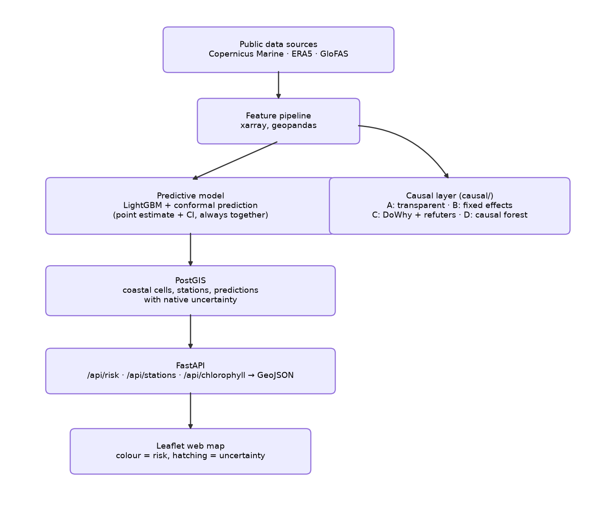
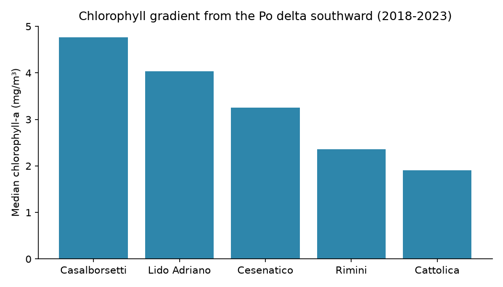
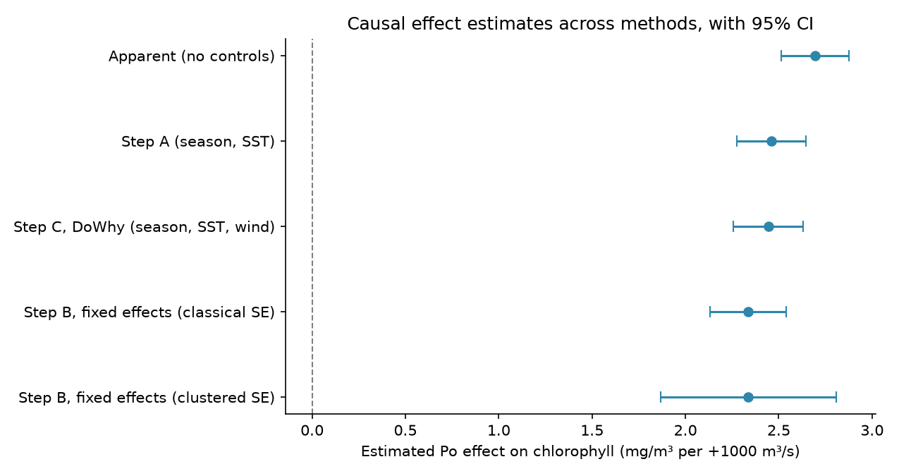
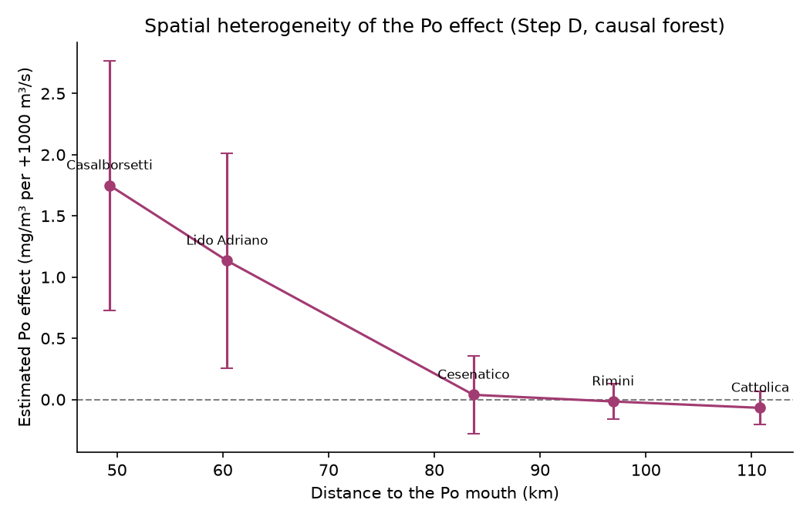
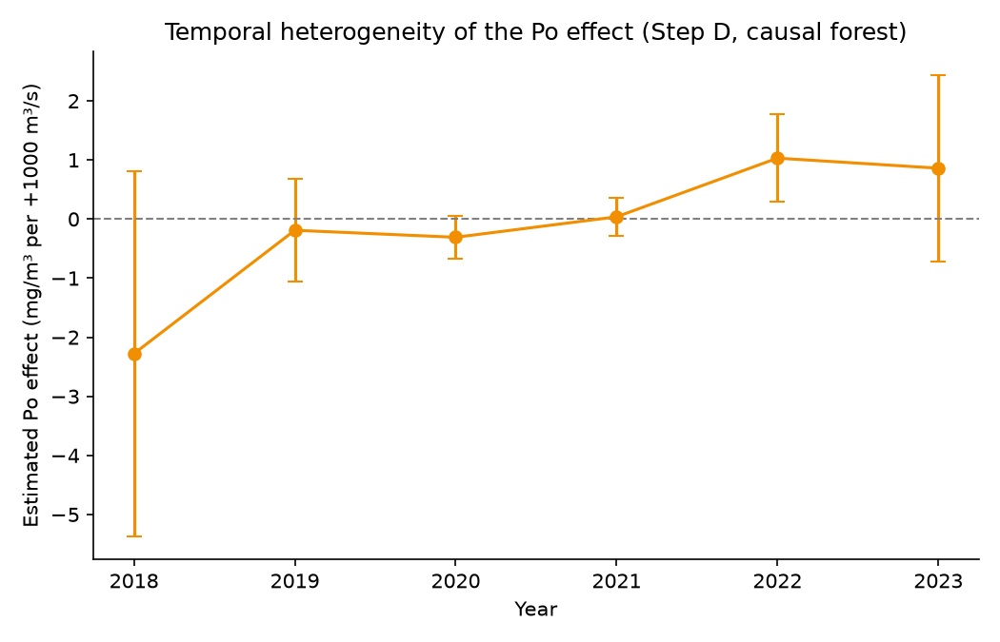

# Adriatic Bloom Risk: an operational geospatial system for phytoplankton bloom-risk estimation with quantified uncertainty and a causal analysis of Po river influence on the Romagna coast

**Author:** Antonio Rotundo

**Status:** Independent technical report / working paper (not peer-reviewed).

---

## Abstract

Phytoplankton blooms along the Romagna coast (northern Adriatic Sea) are driven primarily by the nutrient load of the Po river, and their monitoring supports water-quality management. This report presents an end-to-end, reproducible geospatial system that estimates bloom risk from freely available satellite and hydro-meteorological data, serves the results through a spatial database and a web map, and quantifies the uncertainty of every prediction. On top of the predictive layer, a causal analysis estimates the effect of Po discharge on coastal chlorophyll-a, adjusted for seasonal and meteo-marine confounders, using a transparent regression, a two-way fixed-effects check, the DoWhy framework with standard refutation tests, and a causal forest for effect heterogeneity. On six seasons (2018–2023) of data over five demonstrative coastal cells, a gradient-boosting model does not outperform a persistence baseline at daily resolution, but 7-day-lagged Po discharge consistently emerges as a leading driver; the causal analysis estimates an average effect of approximately +2.3 to +2.5 mg/m³ of chlorophyll-a per +1000 m³/s of Po discharge, tightly consistent across four complementary methods, robust to a formal sensitivity analysis for unobserved confounding, and concentrated in the cells nearest the Po delta, fading to statistically indistinguishable from zero further south. A year-by-year analysis finds no interpretable temporal trend. The contribution is not methodological novelty but the integration, at fine geographic scale and in an operational, uncertainty-aware form, of methods that are individually established.

**Keywords:** harmful algal blooms; chlorophyll-a; remote sensing; causal inference; conformal prediction; Adriatic Sea; Po river; GIS.

---

## 1. Introduction

Coastal phytoplankton blooms affect water quality, tourism and marine ecosystems. In the northern Adriatic, the dominant driver is the nutrient discharge of the Po river, whose loads exceed those of local rivers by orders of magnitude. Monitoring and, where possible, anticipating high-chlorophyll conditions is therefore of practical interest for regional water and coastal management.

This work builds a concrete, deployable system rather than a static study. The objectives are threefold: (i) to integrate open satellite and reanalysis data into a spatial information system for the Romagna coast; (ii) to estimate a per-cell bloom-risk with an explicitly quantified, validated uncertainty; and (iii) to move beyond prediction toward a causal question: how much coastal chlorophyll changes when Po discharge changes, once seasonal and meteo-marine confounders are accounted for.

The contribution is deliberately framed as one of **integration and scale**, not of new methodology. Remote sensing of chlorophyll, machine-learning prediction of blooms, and even causal machine learning applied to harmful algal blooms are established in the literature (Section 2). What is combined here (a fine-scale, operational, uncertainty-aware system with an explicit causal layer, focused on the specific Romagna transect area) is, to the author's knowledge, not available as an integrated artifact for this coastline. Claims of novelty are limited accordingly.

## 2. Related work

Remote sensing of chlorophyll-a as a proxy for phytoplankton biomass is a mature field, with standard spectral indices and multi-sensor products used routinely for bloom mapping and early warning. Global analyses report an increase in coastal bloom frequency in recent decades. Machine-learning prediction of harmful algal blooms is likewise an active area, spanning gradient-boosting ensembles and deep architectures (e.g. CNN-LSTM), and remote-sensing-based systems that predict bloom presence several days ahead.

The northern Adriatic is among the most studied basins for this topic. The Po is documented as the dominant driver of Italian-side blooms; the waters are optically complex (Case-2) near the river influence, complicating satellite retrieval. Seasonal phenology (spring peak, summer decline, mild autumn recovery) is well characterised. Importantly, several recent studies report a *declining* chlorophyll trend and an oligotrophication of the northern Adriatic over the last decades, associated with reduced phosphorus loads. Causal and explainable machine learning have also begun to appear in this domain, including causally-informed neural networks for HABs and explainable models for shellfish-toxicity in the Adriatic. Reproducible, operational ML pipelines for coastal HAB risk, with calibrated probabilities, strict (non-leaky) evaluation and interactive risk viewers, have appeared very recently for other coastlines as well.

The present work therefore does not claim a first application of causal ML to blooms. Its defensible originality lies in: (i) the fine geographic scale (the Romagna transect area specifically); (ii) the operational, consultable system rather than a static analysis; and (iii) per-cell uncertainty quantification integrated into the product.

## 3. Study area and data

The study area covers the Romagna coast from Casalborsetti (near the Po delta) to Cattolica. For demonstration, the domain is discretised into five coastal cells (Casalborsetti, Lido Adriano, Cesenatico, Rimini, Cattolica); these are simplified square cells, not the official monitoring transects. Data span the bloom seasons (April–September) of 2018–2023.

All data sources are public:

- **Chlorophyll-a:** Copernicus Marine Mediterranean ocean-colour reprocessed product (cmems_obs-oc_med_bgc-plankton_my_l4-gapfree-multi-1km_P1D, variable `CHL`), gap-free multi-sensor, 1 km, daily.
- **Sea surface temperature:** Copernicus Marine Mediterranean SST L4 reprocessed product (`cmems_SST_MED_SST_L4_REP_OBSERVATIONS_010_021`, variable `analysed_sst`), ~0.05°, daily.
- **Wind:** ERA5 single-level 10 m u/v components (Climate Data Store), hourly, aggregated to daily mean wind speed.
- **Po river discharge:** GloFAS historical reanalysis (`cems-glofas-historical`, variable `dis24`; Early Warning Data Store), daily.

In-situ chemical-physical series from ARPAE-Daphne (temperature, chlorophyll-a, transparency at 500 m stations) were requested through the formal environmental-information access procedure but are not yet integrated; when available, they will serve as ground truth for satellite calibration.

## 4. Methods

### 4.1 System architecture

The system is containerised (Docker Compose) and comprises a PostgreSQL/PostGIS spatial database, a FastAPI service exposing GeoJSON endpoints, and a Leaflet web map. Ingestion, feature engineering, model training and the causal analysis are Python scripts run against the database. The design is data-source-agnostic: each source is a replaceable node, so the system runs on public data and can incorporate additional sources without structural change.



**Figure 1.** System architecture: from public data sources to the served web map, with the causal layer branching off the shared feature pipeline. (Same diagram as the Mermaid flowchart in the project's `README.md`, redrawn as a static image here for PDF/Zenodo export.)

### 4.2 Feature engineering

Satellite chlorophyll is cleaned per cell and day by discarding physically implausible values (> 60 mg/m³, satellite artifacts) and aggregating remaining pixels with the median (robust to residual contamination). SST (a smooth field) is sampled at the nearest pixel to each cell centroid that is actually valid on almost all days, searched within a small radius (~15 km) around the centroid rather than at the literal nearest coordinate. An earlier version used the literal nearest coordinate, which in this reprocessed product fell on a masked/land pixel for 3 of the 5 cells (Section 4.4); the corrected search restores full 5-cell coverage. Wind speed is the daily mean of the nearest pixel, and Po discharge is extracted as the maximum over a box on the lower Po (Pontelagoscuro to delta), which robustly selects the river-channel pixel. Rolling medians (7, 30 days), cyclic day-of-year encodings, and distance to the Po mouth are added. Rolling windows and lags are computed within each season to avoid bridging the winter gap.

### 4.3 Predictive model with quantified uncertainty

Chlorophyll-a is predicted from *exogenous drivers only* (SST, wind speed, Po discharge and its 7-day lag, month, cyclic day-of-year, distance to the Po mouth), deliberately excluding past chlorophyll to avoid trivial persistence. A LightGBM regressor is trained with a strict temporal split: train 2018–2021, calibrate 2022, test on the unseen 2023 season. Split-conformal prediction yields a 90% interval for each prediction, whose empirical coverage is validated on the test set. A per-cell **risk** is then derived as the probability that chlorophyll exceeds that cell's high threshold (local 90th percentile), estimated from the conformal residual distribution, combining a physical prediction with an interpretable exceedance probability.

### 4.4 Causal analysis

The causal question is the effect of (7-day-lagged) Po discharge on chlorophyll, adjusted for confounders. Four complementary approaches are used. **(A) Transparent estimate:** ordinary regression with and without confounders (season, SST), so that the change in the coefficient makes the confounding explicit. **(B) Fixed-effects robustness check:** a two-way fixed-effects regression (cell and year dummies, season and wind as controls) that absorbs any time-invariant per-cell trait and any year-specific shock common to all cells, a stricter, still fully transparent test, at no additional library cost; standard errors are also reported clustered by cell, alongside the classical ones, since discharge and chlorophyll are autocorrelated within a cell over time. **(C) DoWhy:** an explicit DAG (confounders → treatment and → outcome; stratification declared as a mediator and not adjusted for the total effect), formal identification of the back-door adjustment set, estimation, three refutation tests (placebo treatment, random common cause, data subset), and a formal sensitivity analysis to unobserved confounding (Cinelli and Hazlett's partial-R² bound, benchmarked against SST) quantifying how strong a confounder never measured (currents, other river inputs, solar radiation) would need to be to overturn the estimate. **(D) Causal forest (EconML CausalForestDML):** rather than a single average effect, estimates whether the effect varies with distance to the Po mouth (spatial heterogeneity) and with year (temporal heterogeneity), using the same controls as (B).

Step (B) and (D) deliberately use season and wind as controls, not SST, to stay directly comparable with each other and with a wider effective sample: an earlier version of the SST retrieval (Section 4.2) had valid coverage for only 2 of the 5 cells, which would have silently shrunk any analysis including it to those 2 cells. This has since been fixed, and (A) and (C), which do include SST, are now estimated on the full 5-cell sample rather than a restricted one (Section 5).

## 5. Results

**Chlorophyll gradient.** Cleaned per-cell median chlorophyll decreases from the Po delta southward (Casalborsetti ≈ 4.8 → Cattolica ≈ 1.9 mg/m³), reproducing the documented Po signature from the system's own data (Figure 2).



**Figure 2.** Median chlorophyll-a per coastal cell (2018–2023), ordered by distance from the Po delta.

**Prediction.** On the unseen 2023 season, the driver-based model does **not** outperform a next-day persistence baseline (MAE ≈ 3.63 vs 2.64 mg/m³): chlorophyll is strongly autocorrelated, and exogenous drivers explain slow, seasonal dynamics rather than the day-to-day increment, a known and honestly-reported outcome. Conformal coverage on the test season is ≈ 83% (nominal 90%). Feature importances rank cyclic day-of-year, 7-day-lagged Po discharge and Po discharge highest; the prominence of lagged Po is stable across the move from one to six seasons.

**Causal effect (average).** The raw correlation between lagged Po and chlorophyll is r ≈ 0.38. The apparent effect (no controls) is +2.69 mg/m³ per +1000 m³/s; adjusting for season and SST (A) gives +2.46; the DoWhy estimate adjusting for season, SST and wind (C) gives +2.44; the two-way fixed-effects estimate (B), adjusting for season, wind, cell and year, gives +2.34, an 8% reduction from the pooled estimate using the same controls, but still positive and statistically distinguishable from zero (Table 1, Figure 3). The estimate narrows as controls get stricter but does not collapse to zero. Notably, (A) and (C), which include SST, now sit within 5% of (B), against a ~35% gap before the SST coverage fix (Section 4.2): the earlier gap traced to the 2 SST-valid cells being, at the time, precisely the 2 cells nearest the Po delta where the causal forest (D, below) independently finds the strongest effect, so restricting (A) and (C) to them had inflated their estimates. Refutation tests for (C) behave as expected: placebo effect +0.01 (≈ 0), random common cause +2.44 (unchanged), data-subset +2.43 (stable). The sensitivity analysis for (C) finds that an unobserved confounder would need to explain more than 29.8% of the residual variance of both Po discharge and chlorophyll to bring the estimate to zero (27.9% to erase significance at the 5% level). Benchmarked against SST, a confounder as strong as SST would leave the estimate at +2.34 (95% CI +2.16, +2.52), and even three times as strong, at +2.14 (95% CI +1.98, +2.31). Over the observed discharge range (~460–3970 m³/s), the implied average effect is of order 8–9 mg/m³.

**Table 1.** Estimated Po effect on chlorophyll-a across methods (mg/m³ per +1000 m³/s of Po discharge).

| Method | Estimate | 95% CI |
|---|---|---|
| Raw correlation (Po t-7 vs chlorophyll) | r = 0.38 | n/a |
| Apparent effect (no controls) | +2.69 | +2.51, +2.87 |
| Step A: transparent estimate (season, SST) | +2.46 | +2.27, +2.65 |
| Step C: DoWhy (season, SST, wind) | +2.44 | +2.27, +2.62 |
| Step B: fixed effects, classical SE (season, wind, cell + year) | +2.34 | +2.13, +2.54 |
| Step B: fixed effects, clustered SE (by cell) | +2.34 | +1.87, +2.81 |



**Figure 3.** Causal effect estimates across methods, with 95% confidence intervals (same data as Table 1).

**Causal effect (heterogeneity).** The causal forest (D) finds a spatial pattern: the estimated effect decreases monotonically with distance from the Po mouth, from +1.75 mg/m³ per +1000 m³/s at Casalborsetti (90% CI +0.73, +2.77) and +1.13 at Lido Adriano (CI +0.25, +2.01), to statistically indistinguishable from zero at Cesenatico, Rimini and Cattolica (CIs spanning zero) (Figure 4). This is directionally consistent with a physical dilution of the river's influence with distance, though it remains a descriptive pattern over 5 cells rather than a validated general law.



**Figure 4.** Spatial heterogeneity of the Po effect: estimated effect vs distance to the Po mouth, with 90% confidence intervals (causal forest, Step D).

The year-by-year estimates show no interpretable trend (Figure 5): confidence intervals are wide, particularly at the ends of the 2018–2023 series, and no claim is made about a link to the documented Adriatic oligotrophication trend. The data neither confirm nor rule it out. No formal refutation test was run for the causal forest, making this the most exploratory of the four causal analyses.



**Figure 5.** Temporal heterogeneity of the Po effect: estimated effect by year, with 90% confidence intervals (causal forest, Step D).

## 6. Discussion and limitations

The results are internally coherent: a driver identified as predictively important (lagged Po) is also the treatment whose causal effect survives adjustment and refutation. However, several limitations bound the interpretation and are stated explicitly.

- **Unobserved confounding.** Refutation tests assess robustness to method and data, not the existence of confounders absent from the dataset (currents, other river inputs, solar radiation). If such confounders exist, part of the estimated effect may belong to them. This is the structural limit of observational causal inference. The sensitivity analysis (Section 5) bounds, rather than eliminates, this risk: a hidden confounder would need to explain more than 29.8% of the residual variance of both treatment and outcome, comparable to or stronger than SST, the strongest confounder actually in the model, to matter.
- **Temporal autocorrelation.** Discharge and chlorophyll are autocorrelated series; standard confidence intervals are consequently too narrow. Point estimates are more reliable than their stated precision. Quantified for (B): clustering standard errors by cell widens its 95% CI from (+2.13, +2.54) to (+1.87, +2.81), +131% wider, without changing the qualitative conclusion. With only 5 clusters this clustered interval is itself approximate (few-cluster asymptotics are unreliable below ~20–30 clusters), so it is read as a directional confirmation, not a precise replacement.
- **Scale and form.** Five demonstrative cells over six seasons, with mostly linear causal specifications, make the average-effect estimates indicative rather than definitive; the causal-forest heterogeneity results (Section 5) are more exploratory still, given the small number of distinct spatial and temporal units and the absence of a formal refutation test for that method.
- **SST data coverage (fixed).** The nearest-pixel SST retrieval used to be valid for only 2 of the 5 cells across all six seasons in this reprocessed product; the other three consistently fell on a masked/land pixel, a systematic issue rather than missingness at random. The retrieval now searches a small radius around each cell centroid for the nearest pixel that is actually valid (Section 4.2), restoring full 5-cell coverage; the results in Section 5 are from the pipeline re-run after this fix, and the earlier gap between (A)/(C) and (B) (Section 5) turned out to be substantially a symptom of this bug rather than a real methodological discrepancy.
- **Satellite retrieval.** Near-shore Case-2 waters tend to bias satellite chlorophyll upward; in-situ calibration (pending ARPAE data) would mitigate this.
- **Prediction.** The predictive value at daily resolution is limited relative to persistence; the system's strength is the operational architecture, validated uncertainty, and causal framing rather than forecast accuracy.

Accordingly, results are reported as *estimated and robust under the stated assumptions*, not as *demonstrated causal effects*.

## 7. Conclusions and future work

This report presents an integrated, reproducible system for coastal bloom-risk estimation on the Romagna coast, combining open remote-sensing and reanalysis data, an uncertainty-aware predictive model, and an explicit causal analysis of Po influence. The main value is engineering and methodological transparency at fine scale, not a new scientific result.

Future work: integrate ARPAE-Daphne in-situ series for calibration and functional-group labels; extend the record to more seasons to strengthen both prediction and causal estimation, and to give the heterogeneity analysis (Section 5) enough distinct spatial and temporal units for a less exploratory reading; and refine the demonstrative grid toward the official transects.

## Data and code availability

Source code: https://github.com/antoniorotundo2/adriatic-bloom-risk (MIT license). Raw data are not redistributed; they are reproducible from the ingestion scripts using free Copernicus Marine, Climate Data Store and Early Warning Data Store accounts. In-situ data remain subject to ARPAE-Daphne terms of use.

## How to cite

Rotundo, A. (2026). Adriatic Bloom Risk: an operational geospatial system for phytoplankton bloom-risk estimation with quantified uncertainty and a causal analysis of Po river influence on the Romagna coast. Zenodo. https://doi.org/10.5281/zenodo.21204039

```bibtex
@techreport{rotundo2026adriatic,
  author = {Rotundo, Antonio},
  title  = {Adriatic Bloom Risk: an operational geospatial system for
            phytoplankton bloom-risk estimation with quantified
            uncertainty and a causal analysis of Po river influence
            on the Romagna coast},
  year   = {2026},
  doi    = {10.5281/zenodo.21204039},
  url    = {https://doi.org/10.5281/zenodo.21204039},
  note   = {Zenodo}
}
```

## References

DOIs marked **[verified]** were confirmed against the source during preparation. Those marked **[verify]** are well-known works whose bibliographic details should still be checked against the original, and the causal-ML reference below still needs its final DOI retrieved from the article page. Every reference must be read in its original form before being cited in a formal publication.

1. Dai, Y., Yang, S., Zhao, D., Hu, C., Wang, X., Anderson, D. M., Li, Y., Song, X.-P., Boyce, D. G., Gibson, L., Tang, L., Feng, L. (2023). Coastal phytoplankton blooms expand and intensify in the 21st century. *Nature* 615(7951), 280–284. https://doi.org/10.1038/s41586-023-05760-y  **[verified]**
2. Caballero, I., Fernández, R., Escalante, O. M., Mamán, L., Navarro, G. (2020). New capabilities of Sentinel-2A/B satellites combined with in situ data for monitoring small harmful algal blooms in complex coastal waters. *Scientific Reports* 10, 8743. https://doi.org/10.1038/s41598-020-65600-1  **[verified]**
3. Marzidovšek, M., Francé, J., Podpečan, V., Vadnjal, S., Dolenc, J., Mozetič, P. (2024). Explainable machine learning for predicting diarrhetic shellfish poisoning events in the Adriatic Sea using long-term monitoring data. *Harmful Algae* 139, 102728. https://doi.org/10.1016/j.hal.2024.102728  **[verified]**
4. *Bridging causality and deep learning for harmful algal bloom prediction* (2026). *Water Research* (DECI + Double Machine Learning + Causally-Informed Neural Network). Article: https://www.sciencedirect.com/science/article/abs/pii/S0043135426001740  **[retrieve exact DOI from the article page]**
5. Alhashemi, A. (2026). REDNET-ML: A Multi-Sensor Machine Learning Pipeline for Harmful Algal Bloom Risk Detection Along the Omani Coast. *arXiv* 2603.04181.  **[verified]**
6. Declining ocean greenness and phytoplankton blooms in low to mid-latitudes under a warming climate (2025). *Science Advances*. https://doi.org/10.1126/sciadv.adx4857  **[verified: supports the coastal chlorophyll-decline / oligotrophication trend]**
7. Hersbach, H. et al. (2020). The ERA5 global reanalysis. *Quarterly Journal of the Royal Meteorological Society* 146(730), 1999–2049. https://doi.org/10.1002/qj.3803  **[verify]**
8. Harrigan, S. et al. (2020). GloFAS-ERA5 operational global river discharge reanalysis 1979–present. *Earth System Science Data* 12, 2043–2060. https://doi.org/10.5194/essd-12-2043-2020  **[verify]**
9. Mishra, S., Mishra, D. R. (2012). Normalized difference chlorophyll index: a novel model for remote estimation of chlorophyll-a concentration in turbid productive waters. *Remote Sensing of Environment* 117, 394–406. https://doi.org/10.1016/j.rse.2011.10.016  **[verify]**
10. Copernicus Marine Service: Mediterranean ocean-colour and SST reprocessed product documentation (product IDs cited in Section 3).  **[cite product DOIs from the Copernicus Marine catalogue]**
